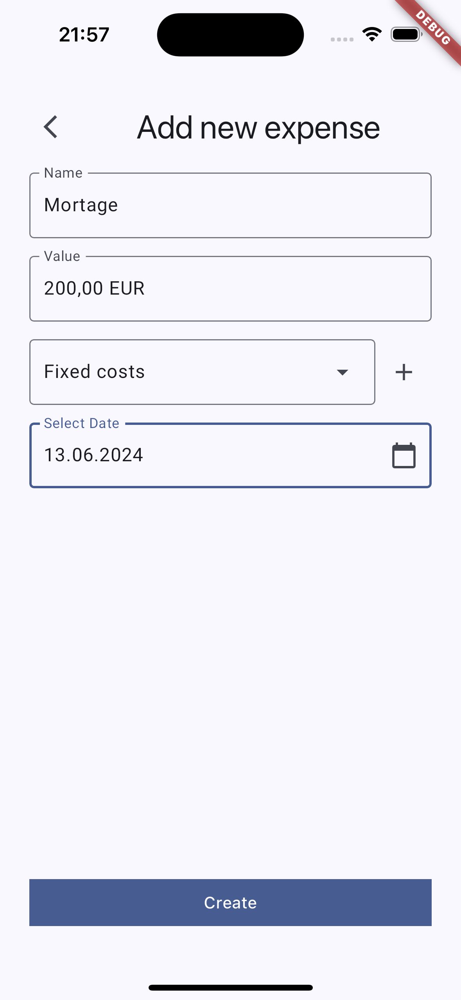

# Budget Manager App





A simple app to manage expenses.

## Getting Started

Before running the app for the first time, execute the following command:

```
flutter packages pub run build_runner build --delete-conflicting-outputs 
```

#### Flutter Version: 3.22.2

#### Tested Platforms:

:white_check_mark: Android<br>
:white_check_mark: iOS<br>
:x: Windows<br>
:x: Web<br>
:x: macOS<br>
:x: Linux<br>